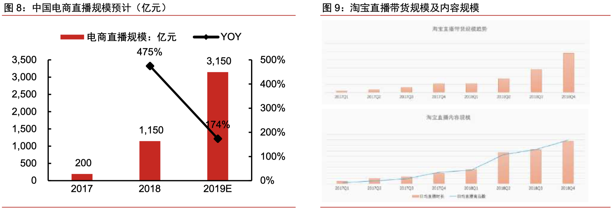
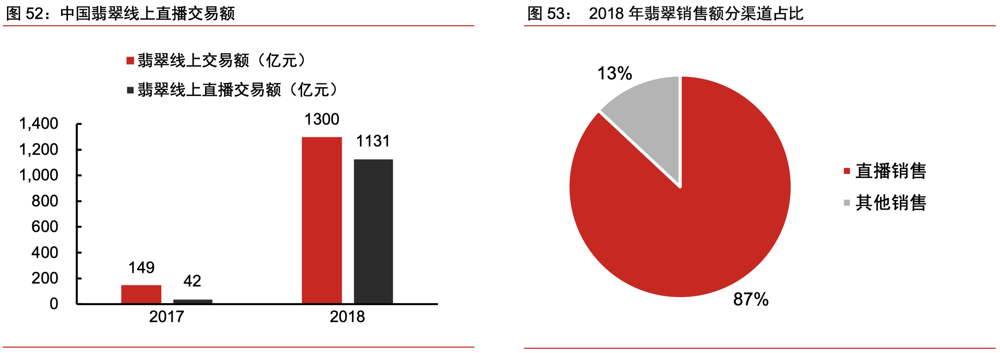
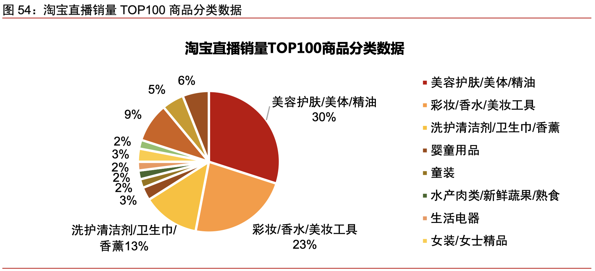
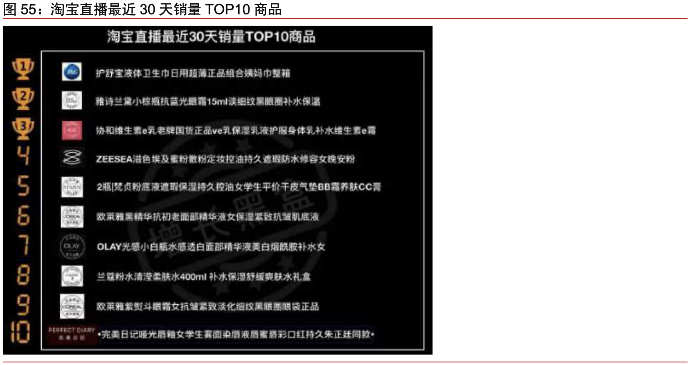
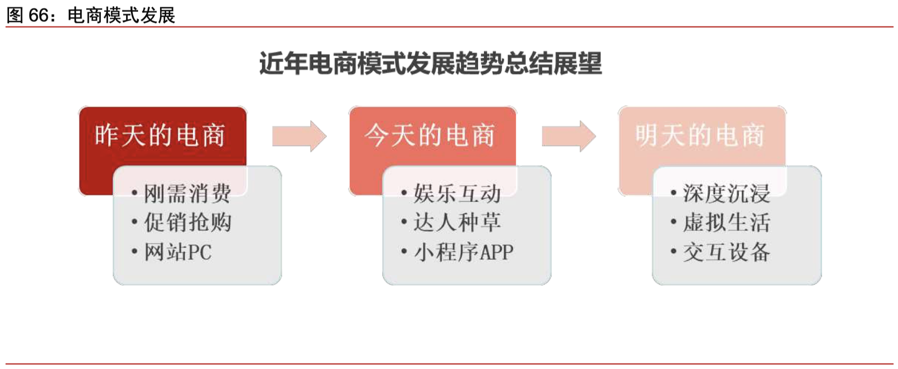
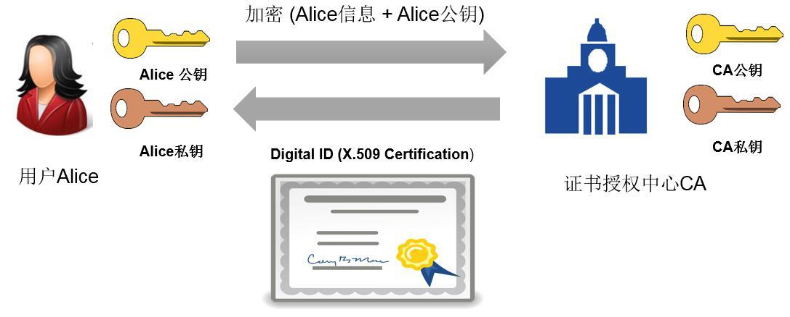

# Live Show Points (LSP)

## 直播电商环境下的数字共享经济

## 执行摘要

电商直播对于商家、用户、平台价值巨大，其兴起并非短期现象，而是流量争夺加剧、电商内容化大背景下的大势所趋，随着主要平台积极推进、产业专业化提升及技术创新，行业有望持续快速发展。而基于区块链技术开发的LSP，将助力这波行业发展浪潮，同时把行业红利带给所有参与其中的专业人士及普通消费者。

▍行业概览：

**1）发展：**近年淘宝、快手、抖音等头部平台发力电商直播，随着李佳琦、薇娅的爆红，2019 年电商直播爆发式增长，行业总规模预计超 3000 亿；

**2）价值：**电商直播实时交互式线上导购模式，带来更好的用户体验、给商家提供了良好的营销机会，并推动了电商平台的内容化；

**3）产业链：**电商直播主要由流量端和供应链端构成，其中流量端包括电商直播平台、MCN 及主播红人，负责获取用户流量，供应链端包括传统电商平台和商家，负责供应链运营。

▍行业驱动：

**1）提升用户体验：**实时交互式导购带来更丰富、深入的用户体验，促进用户购买；

**2）传统电商平台内容化：**流量红利趋弱，网购用户增速降至约 10%，用户花在移动购物的时间占总时长仅 4%，传统电商平台急需富媒体提升用户粘性；

**3）短视频平台商业化：**短视频用户规模超 8.2 亿，月人均使用时长达 22.3 小时，海量流量有赖电商直播模式变现；

**4）内容环节产业化：**MCN 及优质主播体系逐步成型，机构数量已超 5000 家，直播内容质量与供应链把控能力持续提升；

**5）基础设施完善：**移动互联网及电商基础设施网络基本构筑，4G 普及、提速降费，移动支付渗透率超 70%，乡镇快递网点覆盖率超过 90%。

▍产业链格局：

**1）流量端：**直播流量平台汇聚电商流量，淘宝直播高速发展，日内容时长超 15 万小时，2019 年 GMV 破 2000 亿元，快手、抖音持续发力，GMV 均超百亿元；主播与 MCN 生产专业内容，以谦寻为代表的头部 MCN 正在持续完善流量与供应链的专业化运作；

**2）供应链端：**依托成熟完整的供应链与电商服务能力，传统电商平台成为承接直播流量的主要平台，同时也掌控庞大电商流量、拥有最完整的供应链与电商服务基础，主导产业规则；垂直品类商品渗透率提升，电商直播打开了大量非标产品以及新品的机会，成为服装、珠宝、美妆、食品等类目重要渠道，女装直播转化率达约 20%，翡翠直播交易额占网购 90%。

▍发展趋势：

**1）内容化：**电商直播强势提升消费者体验，是电商内容化中重要组成与中长期趋势；

**2）融合化：**直播将持续融入传统电商，成为运营受众用户与新品发行的重要方式，成为部分非标品类的标配线上导购工具；

**3）技术创新：**5G、虚拟、区块链等技术进步下直播形式有望进一步演进，升级为“云逛街、云购物”。

▍Live Show Points 优势：

Live Show Points - LSP 是在区块链科技浪潮下为直播电商的诸多参与者专门设计的一种多方共赢的积分通路（Channel）。供货厂商、电商主播、消费者等直播电商参与者在 LSP 通路中进行各类核心场景的贯穿。所有的相关行为都会结合线上或线下的特点进行优化处理，因此将极大提高电商直播的运转效率。每一个参与者都会从电商直播场景中成本的降低、用户粘性的增强、商业模式的扩展、用户体验的提升、互动方式和直播内容的多元化中找到可以获得的价值点。

------

## 行业概览：李佳琦/薇娅迅速走红，电商直播风口正兴

### 发展历程：李佳琦/薇娅爆红，淘宝、快手、抖音发力电商直播

**“OMG，买它买它！”——“口红一哥”李佳琦的迅速走红，见证了电商直播 2019 年的风头。**头部主播展示出极强的带货能力，“口红一哥”李佳琦 5 分钟卖光 15000 支口红、10 秒钟帮张大奕卖出 10000 支自制洗面奶，而“淘宝直播一姐”薇娅全年带货 27 亿 GMV，双十一开始后的两个小时内引导销售额达 2.67 亿。平台角度，根据淘宝官方公布数据，预售首日淘宝直播引导成交同比增长了 15 倍，有 1.7 万品牌在线直播，“双十一”当天淘宝直播带动成交额超 200 亿元，2019 年全年电商直播 GMV 预计将超过 2000 亿元，电商直播模式迅速兴起。

**2016 年淘宝上线直播以来，电商直播行业迅速发展，快手、抖音等也发力。**2015 年以张大奕等微博红人为代表的网红电商开始兴起，2016 年淘宝、京东正式上线直播功能，电商直播开始逐步发展，2017 年快手、抖音相继上线直播功能，淘宝直播内容、流量、玩法不断升级，2018 年快手/抖音推出了一系列商业变现模式，包括热搜榜、MCN 合作、企业蓝 V 计划等，并上线了购物车项目。通过直播营销带货变现，2019 年淘宝等平台电商直播全面爆发，拼多多、腾讯加入直播大军，电商直播朝向更大的规模、更专业的分工以及与传统电商进一步融合的方向发展。

------

### 产业链：内容流量+供应链，共同构筑电商直播产业链

**电商直播产业链核心由流量端和供应链端构成。**其中，流量端主要包括淘宝直播、快手、抖音平台及 MCN 及主播红人，负责内容生产、用户流量汇聚及分发导流。而供应链端包括电商平台（如淘宝、京东、拼多多等）和众多商家（如服装、珠宝、化妆品等行业商家），负责导流后全套的供应链、售卖、物流、客服等运营工作。通过整个产业链分工，内容与商品以电商直播的形式，触达消费者，实现内容体系构筑、商品销售与品牌建设。

### 产业价值：实时交互式线上导购，带来更好用户体验，为商家提供营销机会

**商家：头部主播“全网最低价”定位，给消费者带来实惠，给商家提供新品发售、大量出货等营销工具与机会。**以淘宝头部主播李佳琦为例，李佳琦直播间较为优惠的价格惠及消费受众，带来高粉丝数、高关注度以及攀升的销量，双十一首场李佳琦直播间累计观看人数 3112 万人，累计出售商品销量 152.7 万。同时其庞大的流量对于商家而言是巨大的发售新品、实现爆款动销的机会，商家通过一定的让利，能够实现目标商品一天千万级的曝光与上万件的出货。品牌方面，2019 年天猫双十一，完美日记 1 小时 28 分成交额破亿，击败欧美大牌成为彩妆销售榜品类第一。

**用户：电商直播实现实时交互，线上化导购，大幅提升用户体验。**相比传统图文式电商的单向信息交互，电商直播向用户充分展示了商品详情、优缺点及使用效果，尤其是对于非标品而言，图文展示模式远不如主播讲解高效便捷。买家高频且强交互的场景也促进了不少新型的直播内容的兴起，如直播卖和田玉现场答疑解惑、开蚌取珍珠现场加工成首饰、野生海鲜类产品原产地捕捞等，实时交互的线上化导购大幅提升了用户体验。

### 市场规模：2018 年淘宝直播带货破千亿，2019 年总规模预计超 3000 亿

**得益于平台端对直播的持续加码，以及产业链专业度持续提升、用户直播购物习惯逐步养成，电商直播 GMV 高速增长，2019 年或超 3000 亿元。**电商直播目前已经达到电视直播 10 倍以上的体量，根据《2019 淘宝直播生态发展趋势报告》，2018 年淘宝直播平台 GMV 达 1000 亿元，带货同比增速接近 400%，消费者每天可观看直播内容超过 15 万小时。今年淘宝直播持续保持高增长，据阿里巴巴投资者日披露，2019 财年天猫直播渗透率超过 50%，YTD 同比增速超 140%，2019 年双十一当日淘宝直播 GMV 破 200 亿元，同时快手、抖音也加大电商直播资源倾斜，预计 2019 年行业销售有望超 3000 亿元。

### 发展趋势：电商内容深度提升大势所趋，持续融入综合电商运营

**从传统搜索式电商到社交内容式电商，电商内容深度提升大势所趋。**电商平台具备靠近消费者购买决策的先天优势地位，近年来通过直播、短视频、社区等方式不断加强对内容的精细化运营。**电商直播与传统电商进一步融合，产业链各环节逐渐专业化、规范化。**依托细分受众及粉丝沉淀，电商直播成为商家运营的重要营销工具及部分非标品的标配线上导购工具。长期来看，随着 5G、虚拟等新技术的不断成熟与发展，直播形式将进一步演进，未来有望实现“云逛街、云购物”模式。

------

## 底层驱动：电商内容化大势所趋，传统电商与流量平台共同推动

### 用户体验：从自助搜索到实时导购，电商直播带来更丰富深入的用户体验

**体验提升：线下导购线上化，电商直播提供了更加深度、实时的购物体验。**传统电商以搜索式购物为代表，用户以自助的方式通过关键词搜索完成选品及下单，主要依赖图文与短视频获取商品信息；而电商直播则实现了从“人找货”到“货找人”的转变，同时提供深度实时、富媒体形式的商品展示，促进店家、主播、消费者之间的关系进一步紧密。电商直播实现了线下导购线上化，为用户带来了更丰富、直接、实时的购物体验，例如美妆类主播进行当场口红试色、服装类主播为消费者提供服装搭配建议、海外购物类主播直播采购现场保证货源真实性等。部分店铺还特设回看功能，若用户想看某件产品的直播讲解内容，则可以点击相应的回看按钮观看主播讲解记录。

**红人效应：传统图文推广模式吸引力趋弱，用户自主比货意愿降低，直播推荐降低用户决策成本，红人主播价值提升。**近年来各类图文推广模式盛行，不再独具吸引力，消费者意愿降低。随着生活节奏不断加快，用户阅读长图文自主比货意识逐渐减弱，熟人推荐、红人种草模式的价值凸显。李佳琦、薇娅等红人从消费者的角度出发，基于自身使用情况进行同类产品对比，并告知消费者如何买货才能避免进入商家套路，更容易获得消费者的认同。《2018 年中国网红经济发展洞察报告》数据显示，2018 年上半年网红导购在电商领域的收入占比达到了近 20%，说明用户购买行为容易受到 KOL 影响。

**刺激购买：实时互动激发羊群效应，价格优惠刺激用户消费。**以李佳琦为代表的头部网红依托庞大流量与供应链及品牌商谈价获取一定优惠，打造“全网最低价”为粉丝谋取福利、吸引粉丝下单。店铺直播则主打优惠券或抽奖，消费者在直播间中领券后下单可获得一定优惠。 直播间的限时限量特性使其相比传统电商更具爆发性。 据艾媒咨询统计，2019Q1 近八成中国在线直播用户在直播上看到商品广告有下单冲动。

**用户特征：观看直播用户活跃度、消费水平高于平均。**Questmobile 数据显示，2019 年 9 月看直播网购人群中线上消费能力在 1000 元以上的占比 23.7%，200-1000 元之间的占比 53.5%，TGI 分别为 135.7 及 127.8，消费水平高于平均；直播网购人群的移动互联月人均使用时长/月人均使用次数分别为 8624.7 分钟/3546.6 次，均高于移动全网用户。

### 传统电商平台内容化重镇：流量红利趋弱，亟待富媒体内容提升用户粘性

**互联网用户人口红利趋弱，传统电商平台用户增长放缓，流量与注意力竞争持续加大。**互联网用户增长红利趋于尾声，传统电商用户增速放缓，持续加码营销投入及商品促销背景下，以天猫、京东、唯品会为代表的传统主流电商平台用户增速仍持续下降，整体网络购物用户数已下滑至约 10%水平（CNNIC）。同时存量竞争背景下，电商平台之间、电商平台与社交内容平台之间的对用户时间的争夺持续加剧，**如何让用户更长、更深入地在平台留存与消费，成为传统电商平台面临的最重要问题之一。**

**传统电商平台在用户粘性和时长占据方面，显著低于内容和社交平台，社交内容电商兴起背景下，亟待完善内容体系留存用户流量。**

 1）早期发展过程中，电商平台偏重供应链能力，平台核心围绕提供最优质的购物服务开展运营，典型如早期的淘宝和京东，但购物场景相对社交、短视频/长视频等内容娱乐场景占用的用户时长与频次显著较低， 据 Questmobile 数据，2018 年 9 月用户花在移动购物上的时间仅占总用户时长低于 4%，显著低于移动社交（35%）、移动视频（20%）、手机游戏（8%）、新闻资讯（8%）等主要的社交内容平台。

2）而当前阶段用户与流量红利见顶，主要平台对用户时间与钱包的争夺持续加剧，社交内容电商兴起，以淘宝为代表的传统电商平台亟待完善内容体系，提升用户综合体验，实现更好的用户留存及消费。

**直播模式能够有效提升用户参与粘性以及与商户的互动，提供更好的产品体验，成为电商平台内容化的重要产品，获得平台持续的资源投入。** 以淘宝为例：

1）近年来以淘宝为代表的电商平台持续推进内容化，推出微淘等内容功能，同时持续与微博、文娱业务等合作完善内容生态，实现用户从纯购物到边逛边玩边购物的转变；

2）直播作为淘宝内容化的重镇，获得了平台持续的资源投入，从前期的对直播内容的优先推荐，到对开设直播功能的店铺增加展示权重，再到持续完善直播产品功能，当前已有超过 50%的品牌商家开设直播，未来或对商家全面推进直播功能。

### 短视频平台商业化重要出路：聚集海量流量，亟需流量变现模式

**以抖音快手为代表的短视频平台近年崛起，迅速占据大量用户注意力。**短视频受益于集社交、红人为一体的内容体系及“短平快”的内容消费模式，对于移动时代用户具备巨大的吸引力。据 Questmobile 统计，截至 2019 年 6 月，短视频用户规模超 8.2 亿，同比增速超 32%，与在线视频用户规模仅相差 1.4 亿；短视频月人均使用时长达 22.3 小时，显著领先于手机游戏及在线视频，成为近几年增长最快、规模最大的流量池之一。

**抖音、快手为当前短视频赛道主要的玩家。**据 Questmobile 统计，2019Q3 短视频月活榜单中抖音、快手均位居前列，月活数分别为 3.5 亿人和 3.3 亿人。快手主打“以人为本，去中心化”，面向下沉市场用户，通过营造平民化、去中心化的社区氛围，建立主播与用户之间的强信赖关系，从而实现人带货的电商模式。抖音则以内容为核心，从中心化出发，聚焦年轻人潮流个性的生活态度，依托高流量池进行推广，从而提升品牌曝光度实现高触达及高转换。

**红人/直播模式凭借粉丝效应带货能力强，方便用户购物决策。**短视频凭借着丰富活泼的内容、与生俱来的社交属性与对碎片化时间的占据集聚了巨大的流量。据 QuestMobile 《中国移动互联网 2019 春季报告》显示，截至 2019 年 3 月，中国移动互联网用户人均每天花近 6 个小时玩手机，近四成时间在看短视频。短视频日活亿级的流量为带货提供了良好的引流入口，同时以内容兴趣精准、红人粉丝关系导流目标用户，有效提高商品转化率，达人主播推荐与实时直播互动形式方便消费者商品的全方位了解，减少了消费者购物决策时间，带货逐渐成为流量变现的重要模式。

**短视频平台货币化持续推进，除广告和打赏外，流量转向电商变现。**

1）依托用户红利、低营销门槛、信息承载量及肥尾效应，短视频具有流量变现的先天优势。随着短视频行业的竞争加剧，各大平台已完成前期流量积累，传统的变现模式包括广告及直播打赏，而当前广告模式相对成熟，亟需发展新的流量变现模式。 

2）电商直播利用网络红人的粉丝黏性，吸引粉丝购买红人推荐的产品，刺激用户的瞬间消费潜力，可实现私域流量向电商平台的导流变现，符合短视频平台的流量特征，愈发成为短视频/直播平台的重要变现渠道。据 BigData-Research 统计，目前快手商家号用户数超过 60 万，每日新增用户数超过 1 万，每日新增商家作品超过 50 万，日均直播场次超过 20 万。

### 内容环节产业化：MCN 及优质主播体系逐步成型，电商直播产业化趋势持续推进

**MCN 机构持续扩张与专业化，推动电商直播产业化。**据克劳锐《2019 年中国 MCN 行业发展研究白皮书》统计，截至 2018 年 12 月，中国 MCN 机构数量已经超过 5000 家，且 90%以上的头部红人被 MCN 公司纳入，或成立了自己的 MCN。当前 MCN 机构的变现方式主要包括广告营销、内容电商、平台补贴及课程销售。2018 年 MCN 变现模式中，内容电商占比 35.5%，头部 MCN 中内容电商占比 17.4%，MCN 机构体系的逐渐成熟将持续驱动电商直播行业保持增长。

**优质主播体系逐步成型，专业素养提升驱动电商直播增长。**据 AdMaster 发布的《2019 中国社会化及内容营销趋势》显示，2019 年社会化营销途径中 KOL 拔得头筹，成为广告主最受欢迎的社会化营销方式，占比达 60%。相比网红依靠情感寄托吸引流量，电商主播致力于凭借专业能力构建粉丝信任，从而缩短消费者的决策时间，实现更高的商品转化率。目前越来越多的垂直领域中深耕多年的专业人士开始涌现在电商直播平台上，如专柜 BA、服装生产商、珠宝销售、产品经理等，对商品及产业的深刻认知使得他们相比其他素人主播能实现更好的转化率。此外，为了提高电商主播的专业素养，淘宝还专门推出每月的线上珠宝节，定期组织主播进行专业培训，帮助商家实现销售及运营的升级。

### 基础设施：移动互联网及电商基础设施持续渗透，全国高效网络基本构筑

**移动设备覆盖提升及移动运营商提速降费，构筑直播产品内容分发基础。**智能手机的普及有利于短视频、直播类内容消费习惯的养成。据 CNNIC，截至 2019 年 6 月，我国手机网民规模达 8.47 亿，移动宽带平均下载速率与五年前相比提升约 6 倍，手机上网流量资费水平降幅超 90%。截至 2019 年 9 月，我国移动通信基站总数达 808 万个，其中 4G 基站总数为 519 个，4G 高速网络占比持续提升，充分保证网络在线直播流畅，大幅减少直播卡顿、音画不一致的情形。同时，三大运营商自 2018 年 7 月起逐步实施提速降费政策，取消漫游费+流量平均资费下降进一步降低了用户观看直播的成本。

**大数据智能推荐算法实现精准推送，从千人一面转向千人千面。**搜索推荐经过多年的发展，已经形成了完整的深度学习智能决策体系。基于用户历史浏览数据及购买行为，对用户进行个性化标签分类，在多阶召回技术的基础上通过对用户兴趣进行深度学习的挖掘，推送其可能感兴趣的直播，实现内容与用户之间的精准匹配，从而使流量得到充分利用，最大限度的提高转化效率。淘宝产品总监陈镭表示将在淘宝直播中利用大数据的理论，实现对不同人群不同场景的智能分发，并指导商家反向优化其产品。

**物流及支付体系持续完善，偏远地区用户的电商价值持续被发掘。**移动支付渗透率持续提升，电商物流等基础设施持续完善，乡镇快递网点覆盖率超过 90%，下沉市场金融支付与物流等基础设施持续完善，大大提高了偏远地区用户的购物体验。

1）金融支付方面，据 CNNIC，截至 2019 年 6 月，我国手机支付用户规模已达 6.2 亿，用户移动支付习惯持续建立且移动支付场景覆盖不断提升，目前我国移动支付渗透率已达 73%。

2）物流方面，据网经社-电子商务研究中心检测数据显示，截至 2019 年 3 月，我国已累积建设县级电子商务服务中心和县级物流配送中心 1000 多个，乡镇快递网点 8 万多个，乡镇快递网点覆盖率超过 90%，建制村直接通邮率接近 100%。

## 产业链：供应链与流量端优势互补，共同构筑直播产业

### 产业分工：流量端与供应链协同，共享产业收益

**电商直播产业链核心由流量端和供应链端构成，其中流量端主要包括淘宝直播、快手、抖音平台及 MCN 及主播红人，负责获取用户流量，而供应链端包括主要电商平台和商家，负责导流后全套的运营。**目前部分短视频直播流量平台也自建了电商平台，如快手、抖音站内自建小店等，电商直播产业链各环节基于自身优势，实现专业分工、价值创造与收益分配。当然整体而言，**头部平台凭借绝对优势的供应链能力、电商生态优势与流量优势，主导了整个产业链的发展趋势与收益分配。**

**收益分成方面，电商直播以 CPS（按成交额收费）模式为主，MCN 与主播、流量平台、电商平台共同分成。**KOL 主播通过各种方式（如短视频种草/直播带货）帮助商家推广后根据成交量及事先商定的佣金比利结算相应的佣金份额，平台方再抽取一定的内容场景服务费/技术服务费，最后按照相应的比例与 MCN 平台进行分成得到最后的佣金收入。对淘宝平台而言，淘宝平台收取一定的内容场景服务费（一般为 6%），流量平台收取部分服务费，然后 MCN 和主播分剩余佣金收入。诚然，由于不同商家商品佣金率设置、平台间博弈、MCN 与主播之间博弈关系等因素影响，实际分成结构较为复杂且动态变化。

### 流量端：主播与 MCN 生产专业内容，流量平台汇聚高质量流量

### 流量平台：淘宝、快手、抖音等依托自身内容与场景优势汇聚用户

**流量平台端：淘宝直播高速发展，快手、抖音持续发力。**从行业规模看：淘宝直播平台 2018 年带货超过 1000 亿元，同比增速近 400%，是目前最大的电商直播平台。而快手与抖音两大短视频/直播平台也从 2019 年开始投入大量资源参与到电商直播行业中，预计快手、抖音 GMV 均超百亿。

1）**淘宝直播：丰富的内容矩阵&庞大的用户基础，助力淘宝直播实现跨越式发展。**根据淘榜单&淘宝直播联合数据显示，当前消费者每天可以观看的淘宝直播内容超过 15 万小时，可购买的产品数量超过 60 万种。在购物场景方面淘宝直播占据了显著优势，背靠淘宝巨大的用户基础以及用户极强的购物目的性，淘宝直播能够实现更高的下单量以及转化率。根据淘榜单和淘宝直播联合发布的《2019 淘宝直播生态发展趋势报告》，每月带货规模超过 100 万的直播间数量已超过 400 个。

**直播结合扶贫创造社会价值，邀请明星带来现象级流量。**2018 年 9 月 17 日淘宝直播号召全网最强十大农产品带货主播助阵 9.17 丰收节晚会，4 小时创造了 1000 万的销售奇迹；淘宝直播顺势推出村播计划，助力优质农产品上行，实现产业扶贫。 2019 年 7 月淘宝直播正式启动“启明星计划”，明星的粉丝效应和影响力能够帮助淘宝直播跳出自有生态，辐射到更多增量人群；12 月 4 日晚，电影《南方车站的聚会》主演胡歌、桂纶镁以及导演刁亦男来到了李佳琦的淘宝直播间，当晚在线销售的 25.5 万张电影票在 6 秒钟被一抢而空，活动直播观看人数达到 636 万，互动量超过了 3500 万，#胡歌 武汉话#等话题登上微博热搜。

2）**快手：打造老铁文化，与电商平台开放合作，“草根”主播借助强粉丝粘性玩转电商直播。**Questmobile 数据显示，2019 年 6 月快手的月活跃用户数达 3.41 亿，远高于其他短视频 APP，稳居第一梯队；日活用户的日人均使用时长为 56 分钟。快手电商于 2018 年中旬正式启动，目前与各头部电商平台开放式合作，截止目前，快手合作的第三方平台包括淘宝、有赞、拼多多、魔筷等，其中主要 GMV 导向淘宝，带货类目主要是食品、生活用品、化妆品为主。快手以人为本，通过营造平民化、去中心化的良好社区氛围，在强社交信任关系的驱动下，挖掘粉丝价值，形成以人带货的电商模式，直播 GMV 破百亿，处于国内电商直播平台领先地位。

**快手主打下沉市场用户，自营+三方平台双管齐下。** 快手直播带货下沉至五线城市、乡镇乃至农村，其中“小镇中青年”对快手电商 GMV 的贡献占比最大；快手通过快手小店功能集成电商业务、展示电商商品，其中具体的商品来源可分为快手自营商品和第三方平台商品两大类。快手提供给商家主播的一站式的商品售卖平台，目前只要粉丝大于 5000，免费开通快手商品。

**快手直播主要为实现平台和主播红人的商业化，相比其他平台而言，红人私域流量控制力强，粉丝关系密切。**

1）相比淘宝直播等平台，快手电商偏红人模式，特征为受众和主播的粉丝关系强、对主播的人设认可度高，头部主播不仅带货能力强，且对粉丝流量的控制能力较强。同时，快手平民化、去中心化的流量机制下，头部集中度相对较低，整体主播生态发展较为健康，对于非头部主播发展较为友好。

2）此外，快手也持续提升 MCN 服务，引入如涵、网红猫等服务商，为快手达人提供可靠的电商供应链资源，以及电商销售相关的各项技能培训和服务，甚至店铺的代运营。**我们认为，快手平台的红人与 MCN 整体生态最为平衡健康，同时粉丝关系质量与私域流量控制力最强，持续性与价值较高。**

3）**抖音：算法驱动，内容为王，头部视频引爆带货能力，实现流量变现。**抖音以内容为核心，依靠高流量及算法匹配提升商品曝光率，当然相比快手，其用户与 KOL 的关系较弱，内容的推荐更多是对品牌的购买起到促进作用，用户更多基于视频内容购买；抖音的流量分发模式使得其头部视频的商品容易爆红，实现高流量下的高触达率和转换力。例如，抖音呗呗兔拥有粉丝量 908 万，2019 年 618 期间带货成交额超 1200 万，双十一 期间达 2000 万。

抖音 2018 年 5 月正式启动电商，以短视频、直播带货为主，导流由淘宝等平台对接。服务方面，平台推出抖音星图，支持于原生内容推广，实现订单接收、签约达人管理，项目汇总、数据查看等功能，实现内容交易过程中多重交易角色的连接与沟通，客户可发布需求，选择契合的明星/达人进行内容营销，MCN 公司或明星/达人也可在承接订单后查看需求及对应分析信息。

**抖音短视频带货持续完善，素人主播焕发巨大活力。**目前抖音的短视频电商体系已经逐渐完善，其中供货方为用户自己开通的抖音小店或淘宝、京东、考拉、唯品会等电商平台。99 抖商数据显示，日排行榜第二位的某打底裤单日新增 42.8 万访客，完成约 6 万交易量，单日从抖音产生的交易额约 270 万。抖音上内容为王，平台 KOL 借助短视频吸引粉丝群，同时算法以内容和兴趣匹配为导向，使得素人主播也能够凭借优质内容获得更大的传播机会，例如一位仅有 4415 位粉丝的素人主播发布的带货视频点赞量高达 27.1 万。

**不足：算法分发不利于私域流量运营与深度粉丝关系构建。**相比快手、微博等平台，抖音平台对流量及商业化的把控更强，受众更多为被动接受内容推荐，因此受众与 KOL 关系较弱，私域流量运营能力也较弱。目前短视频与直播电商模式中，包括获取抖音流量到微博等平台进行流量运营变现，以及通过大量抖音中腰部网红批量做电商流量运营。

### MCN 机构与主播：头部集中，专业化水平持续提升

**MCN 机构：经历爆发式增长之后，专业化、产业化持续提升。**截至 2018 年 12 月，我国 MCN 数量已超过 5000 家（《2019 年中国 MCN 行业发展研究白皮书》），90%以上头部网红都被 MCN 收入囊中或成立自己的 MCN 机构。2018 年超三成被调研 MCN 的营收规模在 5000 万以上，营收规模破亿的 MCN 数量占比达到 6%。2019 年原有 MCN 机构通过强化内部效率与核心竞争力不断进化，同时依托新平台的崛起，新的 MCN 还在不断涌现。

**以谦寻为代表的头部 MCN 正在持续完善专业化运作。**作为新内容电商头部机构，谦寻主要业务包括孵化网红主播、短视频内容生产及投放、全域内容营销等，公司旗下拥有 30 多名主播，包括淘宝第一主播薇娅 viya、知名演员高露、知名主持人李响等，行业前 20 占据 6 位，淘内粉丝超千万。谦寻的成功在于拥有一套自己的运营体系和完整的供应链系统，相较于其他机构将大量资源金钱投入在孵化网红，谦寻更多的是为主播及粉丝提供专业化的服务，帮助创作者进行更有规划的生命周期管理。除了继续扩大网红规模外，谦寻还将着力搭建网红供应链体系，持续提升专业化、产业化能力，根据阿里 V 任务机构介绍显示，谦寻计划孵化打造 200 名网红主播，目标 GMV150 亿。

**主播：马太效应显著，带货能力二八分。**

1）根据知瓜数据，在 2019 年 11 月淘宝主播排行榜中，薇娅、李佳琦作为两大头部主播一马当先，薇娅粉丝数共计 1216.79 万、月累计观看人数达到 3.2 亿人次， 李佳琦粉丝数共计 1522.60 万、月累计观看人数达到 1.89 亿人次，而排名第三的主播为明星主持人李湘，粉丝数共计 220 万、月累计观看人数达到 4468 万人次，与两大头部主播差距明显，腰尾部主播差距则更加巨大。

2）根据海马云大数据《2018 抖音研究报告》显示，抖音 2.7%的头部视频，拥有 80%以上用户的关注和参与；粉丝数超过 1 万的头部用户仅为 4.7%，整体用户覆盖率却高达 97.7%。

### 供应链端：头部传统电商承接主要流量并主导产业，垂直商品渗透率提升

### 供应链平台：传统电商平台凭借综合优势主导产业链

目前供应链平台可大致分为三类：

1）淘宝天猫/拼多多为代表的传统电商平台；

2）快手/抖音小店为代表的流量平台自建小店；

3）有赞为代表的第三方服务平台。

**依托全套成熟的供应链与电商服务能力，传统电商平台成为承接直播流量的主要供应链平台。**淘宝直播本身属于淘系，最终销售走向传统淘宝/天猫平台。目前而言，由于快手和抖音等平台优势主要在于社交与内容，在综合供应链与运营方面积累不足，而淘系等传统电商平台可以提供低成本、成熟的 SaaS 系统、支付系统、物流服务、售后等全套体系生态，同时商家也能把直播与传统电商运营结合，获取传统平台一定的免费流量（快手、抖音现阶段的电商更多为红人经济，私域流量，缺乏传统电商平台的消费场景），能够有效服务商户与消费者。因此对于快手、抖音等电商直播模式，传统电商平台也依旧是商家最为理想的最终销售平台。

**头部电商平台掌控庞大电商流量，同时拥有最完整的供应链与电商服务基础，是当前整体产业规则的主导力量。**

1）站内直播方面，以淘宝为代表的平台端掌握了整体的流量分配机制与主播展示，以及拥有完整的电商服务能力，因此主导了产业主要规则。近年电商直播的兴起，很大程度上依赖阿里对淘宝平台内容化的推进，自 2016 年以来阿里对 MCN 机构、主播的流量等综合资源持续的扶持加码保证了今天的电商直播全面爆发，而淘宝直播目前成交体量也占据了电商直播的主要份额。

2）站外直播方面，以淘宝为代表的平台端凭借综合优势成为了站外流量平台和商户当前阶段承接流量的首选，通过对淘客佣金率规则调整，影响整体产业链收益分配。

### 货品与商家：电商直播带动服装、化妆品、珠宝等非标品渗透率提升

**货与商：电商直播为美妆服饰等品类带来销售大幅增长，同时为部分非标垂直类目打 开线上市场。**“双 11”期间淘宝直播在美妆、服饰、食品、家电、汽车等行业全面标配，在家装和消费电子等行业，直播引导的成交同比增长均超过 400%。包括沃尔沃在内的十多个汽车品牌都赶在天猫双 11 前来到直播间，更有上千家 4S 店、2000 多导购转型成淘宝主播；此外超过 15 万场村播开播，5 万件民权花生、4 万件扎赉特大米、3 万件金寨核桃在直播期间被“抢购”一空。**电商直播依靠大流量、实时互动等特征，打开了大量非标产品以及新品的机会，成为服装、珠宝、美妆、食品等类目重要的销售渠道。**

1）**电商直播打开服装销售新路径，女装直播迎来爆发式增长。** 据有赞联合腾讯广告发布的《社交电商 | 女装行业报告》统计，女装类目购买转化率仅为 6.6%，低于有赞各类目购买转化率均值 7.0%，而女装直播转化率则高达 21.2%，显著高于其他类目。2018 年 12 月 18 日，主打淘宝直播走进档口的“老板娘驾到”第一季活动全面启动，通过邀请淘宝直播网红主播及档口老板娘走进广州市场档口直播卖货，通过线上线下相结合的营销模式，为传统服装产业提供了全新的发展模式，不少新主播开播当天就达到了上万的销售额。

2）**珠宝交易逐步线上化，在线挑选打破低转化困局。**电商直播的兴起推动了网购珠宝的快速发展，相比传统珠宝电商的单商品图文描述模式，直播可同时呈现上百款商品并根据消费者的喜好进行在线挑选及讲解，在极大提升消费者的购买效率的同时塑造了透明良好的消费环境。据统计，淘宝珠宝直播日均场次已超过 1 万，珠宝已经成为继服装、美妆外主播人数最为聚集的品类。由对庄翡翠联合中国珠宝玉石首饰行业协会发布的《2018 中国翡翠行业网络消费白皮书》显示，2018 年中国翡翠网购交易额突破 1300 亿元，同比 2017 年增长 7.7 倍，其中直播销售方式占比 87%，销售额达 1131 亿元。

3）**BA 网红化在线种草试妆，美妆类产品霸屏直播销量榜单。**美妆直播提供了消费者近距离与主播互动的途径，店铺主播多方位的对产品进行介绍与试用、推出新品预告及化妆技巧分享，实现了线下美妆导购的线上化。相比线下导购而言，美妆直播在相同的时间内实现更高的销售额。“口红一哥”李佳琦曾是欧莱雅的专柜 BA，按照每天工作 8 小时平均接待一个顾客 20 分钟计算，即使能做到同时 1 对 3，李佳琦单日最多服务不超过 100 个顾客，而成为主播后的他创下了 5 分钟卖出 15000 支口红的销售奇迹。据知瓜数据统计，淘宝直播销量 TOP100 商品中，美容护肤/美体/精油占比 30%，彩妆/香水/美妆工具占比 23%，合计超过 50%，在销量 TOP10 榜单中美妆类产品占据了 2-10 名。

------

## 影响及趋势：直播成为电商平台标配，5G 等技术进步望带来更多可能性

### 电商直播重构产业链各环节的模式玩法

**商品端：传递品牌价值，推广长尾非标产品，引领工厂电商模式化。** 借助 KOL 直播引流种草，大批国货品牌崛起，其中完美日记通过塑造高性价比高创新的品牌形象，仅 18 个月就做到了天猫彩妆类销量第一。除了推广知名热销品牌之外，电商直播通过网红背书、概念植入、经验科普等方式打造内容差异化，推动长尾非标产品的销量迅速蹿升。电商直播促使工厂电商模式化，C2M 模式契合直播带货，其本质是工厂跳过经销商直接对接平台把握消费者需求，快速定制出货。

**传统电商平台：电商平台内容化，深化垂类内容建设。**直播带货缩短了用户决策时长，实现从种草到下单的全流程覆盖，据统计淘宝直播平均每个直播间引流进店率是 65%，转化率最高 30%。目前电商直播主要分为达人直播及店铺直播两种模式，其中，头部达人依托粉丝黏性聚拢流量，以低价出货，同时部分主播借助头部效应孵化自身品牌；店铺直播则主打导购模式，通过对商品多维度的展示及实时互动拉近了店家、主播和消费者之间的距离，实现店铺销量的提升。预计未来更多的流量将引导给直播，电商直播将和传统电商进一步融合，和店铺运营进一步结合，实现更好的内容建设与用户体验。

**短视频直播平台：积极布局电商领域。**核心短视频直播流量平台如快手、抖音也开始着手布局电商领域，自建站内小店，吸引商家入驻实现与用户直接对接， 尽管目前淘宝、天猫、京东仍是主流的电商供货平台，但随着 GMV 增长与电商生态的持续完善，长期看短视频直播平台也将持续融入电商。

### 内容化：电商内容化大势所趋，电商直播强势提升消费者体验，势不可挡

**内容电商从软广告向强推荐演变，直播带货实现低成本引流高店铺转化。**内容电商是以消费者为中心，围绕 KOL、直播、热点事件等进行内容创造，实现商品随内容同步流转换，从而达到电商营销效果的一种电商模式。传统内容电商模式通过免费内容（如小红书笔记）积累流量，用户完成内容阅读后自行去电商平台下单，从而实现流量变现。随着短视频、直播的兴起，直播带货逐渐受到商家的青睐，通过内容分发算法向用户推荐可能感兴趣的达人/店铺直播，在直播间中用户可以多维度了解产品与主播进行实时互动，并直接在直播界面中点击链接下单，整体流程耗时更短更加便捷。据淘宝直播披露，每 100 万观看量就有 32 万的加购（将直播推荐商品加入购物车），2018 年通过淘宝直播带货成交超过 5000 万的店铺有 84 家，其中 23 家成交额破亿。电商直播在低成本流量获取的同时实现了更高的转化率，将成为势不可挡的未来发展趋势。

**电商直播升了消费者购物体验，满足用户社交化需求。**据 Questmobile 统计，在 90 后/00 后二级行业活跃渗透率排行中，即时通讯、在线视频和短视频均位居 TOP4，而综合资讯渗透率均不足 60%，说明当下电商消费者的主流群体比起图文阅读模式更倾向于实时互动、在线视频的模式，因此电商直播能完美的契合主流用户对于实时化、社交化的需求。电商直播的社交化购物场景满足了消费者的非计划性购物需求。

**直播结合明星红人及有趣内容，为传统电商带来流量新机遇。**于电商而言流量即意味着消费的可能：在目前电商流量获取成本居高不下的情况下，直播作为一种自带快速引流特性的媒介，利用红人以及新鲜有趣的直播内容，可以帮助平台低成本获取更多高质量流量，引流效果主要依赖精准推送和直播内容本身。京东直播上线初期，邀请锤子科技 CEO 罗永浩做的一场直播，观看人次破 10 万，其中通过站外分享引入的流量占比将近 50%，直播的吸流效应显著，同时直播中交易相关点击率达到了近 140%，体现了直播流量中蕴藏的消费潜力。

### 融合化：与传统电商进一步融合，产业链各环节持续专业化、规范化

**传统电商与电商直播相辅相成，建立高频、强交互场景。**电商直播与传统电商的融合可以实现对不同目标人群的转化：目标明确的用户可以通过直接搜索关键词进入商品详情页观看传统的图片或固定视频了解商品详情直接购买，而半目的型或无目的型用户则可以通过直播的方式辅助决策激发购买欲望促进店铺转化。美国视频电商 Joyus 的统计表明：通过优质视频来推广商品的转化率比传统图文展示的方式高 5.15 倍；同时其视频观看者购买商品的次数为非产品视频观看者的 4.9 倍。此外直播将消费者临时聚集在一起，构建了一个商家与买家高频及强交互的场景，群体效应更能激起消费者的购买欲。

**细分受众+粉丝沉淀，直播成为商家运营的重要营销工具，助力新品发行、动销与转化。**直播的流量引爆效应显著，已经成为很多商家发行新品、大额出货的重要渠道，例如，明星进入直播间已经成为了近期新片上映宣发的主流玩法。12 月 4 日，电影《南方车站的聚会》主演胡歌、桂纶镁走入“口红一哥”李佳琦的直播间，通过灯塔+淘宝直播共同搭建的“冲击播”线上路演，直播间观看人数达 636 万互动量超 3500 万，25.5 万张电影票仅 6 秒钟就被一抢而空。直播具备高转化率及一定的品牌打造能力，随着产业专业化程度持续提升，对消费类型、产品定位、受众的持续精准细分，直播正愈发成为商家运营的重要营销工具。

**电商直播成为部分非标品类的标配线上导购工具。**相比观看传统电商模式中修饰和美化后的图片短视频，用户更倾向于通过直播观看商品的真实细节，尤其是服装美妆、珠宝文玩等个体差异性大的非标品类。相比标品而言，非标品购买更容易受到产品外观的影响且不强烈要求即时成交。非标品店铺通过直播曝光低价引流，鼓励消费者收藏加购，最终可以通过其他产品实现成交转化。有赞《社交电商女装行业报告》显示， 2019Q1 女装直播订单开始迅速增长，截止至 2019 年 7 月女装直播订单已经超过 60%。

**未来直播与传统电商的融合有望进一步加深，各产业链环节的专业化、规范化持续提升。**

1）传统电商运营重自然搜索流量与在线营销，而直播强大的上新、转化能力，已经成为商家进行流量端运营的重要补充；

2）同时，直播的快节奏与爆发力对供应链造成了巨大压力，进一步提升了商家对产品供应链的把控要求，也提升了对主播专业能力的要求，随着直播运营实践的不断推进，整体流量端、供应链端的合作关系将更加紧密，分工将更加专业，各产业链环节的专业化、规范化有望持续提升。

### 技术创新：5G、虚拟等新技术成熟下，直播形式将进一步演进

**长期来看， 5G、AR/VR、人工智能等技术有望持续完善用户的购物体验，从简单的主播推荐，升级为全面的“云逛街、云购物”。** 淘宝直播负责人赵圆圆将电商的发展分为“昨天的电商、今天的电商、明天的电商”三个阶段，昨天的电商是刚需消费、促销抢购、PC 网站，现在的电商是娱乐互动、达人种草、移动 APP，未来的电商是深度沉浸、虚拟生活、交互设备。我们认为，中长期看，随着商用 5G 的普及以及 AR/VR 技术的逐渐成熟，线上购物体验将持续贴近甚至超越传统线下购物式体验，逐步实现线上 AR 试妆/试衣、智能导购等云购物模式。

**未来有望推出虚拟电商主播，降低店家成本，实现低成本高转化。** 目前 AI 虚拟主播技术已经在音频生产、新闻播报、虚拟主持等多种场景中得以应用，未来有望涉及电商领域实现低成本引流。今年 5 月科大讯飞的的新品发布会使用了全球首个多语种 A.I.虚拟主播，实现中、英、日、韩、俄、西法 7 国语言，记忆维吾尔语、藏语 2 种民族语言同时进行直播，9 月杭州造物节上，科大讯飞公布了一段用 AI 技术合成李佳琦的直播视频。我们认为，随着技术的持续完善，虚拟主播、虚拟红人等有望给商家带来更多的机遇，持续降低商家成本。

## Live Show Points 优势

### 设计理念

也许看到这里，你还在惊讶李佳琦刚买的上亿元的大豪宅🏡？

是不是感叹薇娅全年巨额的带货量💄？

或许你也跟我一样，正期待着愚人节的那天晚上罗永浩的直播电商首秀📺……

如果咱们想的是同一件事情的话🤔，

**那么今天你也可以参与到这波全民浪潮中，享受直播电商带来的红利，让财富不仅仅停留在屏幕前！**

但是你会说这好难啊🤷‍♀️，要懂用户触达，懂供应链管理，能创造内容，能控制私域流量……

也许现在 LSP (Live Show Points) 就是助你打通直播电商的快捷通道👊：

- 看中好物想买了，使用 LSP 进行支付获得更多折扣；
- 有了货源想自己卖货了，LSP 帮你找到最合适的带货主播；
- 甚至，想自己当网红了？不好意思我们不能改变你的容貌，但 LSP 会让你更火！

------

**LSP 的英文全称是 Live Show Points，是在区块链科技浪潮下为直播电商的诸多参与者专门设计的一种多方共赢的积分通路（Channel）**。供货厂商、电商主播、消费者等直播电商参与者在 LSP 通路中进行商品筛选、价格谈判、主播竞选、直播推广、商品上架销售、主播打赏、广告流量变现、实时结算等核心场景的贯穿。所有的相关行为都会结合线上或线下的特点进行优化处理，因此将极大提高电商直播的运转效率。直播电商的本质上是一个“超级大团购”，在这场狂欢下**每一个参与者都会从电商直播场景中成本的降低、用户粘性的增强、商业模式的扩展、用户体验的提升、互动方式和直播内容的多元化中找到可以获得的价值点**。

LSP 资产在区块链上发行，总量为 30,000,000 枚。管理团队只会持有极小比例的 LSP 以支撑基本运营，其余的 LSP 将根据市场和社区活跃度逐步投放。

### 积分通路

区块链技术对公众早已不再陌生，而其精准有效的落地场景却鲜为人知。目前区块链技术在金融场景的应用已逐步得到全球商业的认可，另外在商品供应链层面也常有新的场景应用。**LSP 作为在直播电商领域的创新应用，充分利用了区块链去中心化、普适开放、防篡改、可匿名、可追溯的特点。**LSP 是一种升级版的通用积分，即积分通路，积分通路业务在国外取得了巨大的成功，积分通路的参与者也因此获得了丰厚的盈利；但积分通路在国内还处于起步阶段，离盈利还有很远的路要走。积分通路的参与者可以通过如下方式来实现价值的探索获得：

1. 将积分作为商品出售给加盟商家，加盟商家按照实际花费出去的积分价值向积分通路运营商支付积分费用；
2. 利用会员资源，推荐会员到加盟商家消费，根据会员的消费金额直接从商家获得佣金收入；
3. 利用第三方，如广告联盟，根据会员的行为（点击广告、注册网站、网上消费等）从第三方获得收入；
4. 为有实力的品牌商家开发、管理、运营积分项目，从而获得项目收入；
5. 为有独立积分项目但奖品库不完善或者不愿意管理奖品库的商家提供奖品兑换、采购、配送服务，从而获得奖品管理收入；
6. 为商家提供消费跟踪、市场调查、数据分析、客户维护等营销服务，从而获得营销收入；
7. 整合其他营销方式，如有奖问答、免费试用、自助调查、消费评论等营销形式，为商家提供综合性的营销服务，从而获得营销收入；
8. 为会员提供增值服务，如通过手机为会员提供消费打折信息、优惠券等，直接向会员收取增值服务费用，同时也可向商家收取营销费用；
9. 等待通用积分卡有足够的吸引力和价值后，可向申请通用积分卡的会员收取费用；
10. 出售网站广告位，获得广告收入；
11. 如有足够多的内容，如优惠打折信息、优惠券等，可通过出售内容获得收入；

**积分通路简单来理解就是：跨行业、跨领域、跨系统、跨区域，通积通用**。积分通路业务不是一个独立的产品，它是一个创新的业务模式，更是以异业联盟形式出现的产业价值链。通用积分业务市场容量与当地的消费水平和经济增长潜力有着极大的相关性。

### 技术架构

#### LSP 生态技术架构

LSP 生态技术架构遵循层次化、模块化的设计理念，强调框架的可扩展性、可交互性、性能和安全性。LSP 生态技术架构是包含底层区块链模块以及其相关的外围生态组件的集合体，是基于用户层、LSP 业务服务层、区块链核心层、基础组件层和通用服务层的结构化设计。

**用户层：**

用户层是终端用户的接入点。用户通过用户层访问 LSP 区块链服务。从技术角度来看，LSP 终端用户服务的特性由后续章节的去中心化应用 DApp 服务支持，包含数字钱包、数字资产管理等功能，另外该层还包含用户管理的功能。

**业务服务层：**

业务服务层实现了 LSP 去中心化经济社区的所有核心业务逻辑。从技术角度来看，LSP 的 DApp 去中心化应用为该层提供服务支持。

**区块链核心层：**

区块链核心层，即 LSP 区块链底层，具备共识机制、账本管理、多资产管理、资产交易管理、智能合约等区块链核心功能。另外，LSP 区块链在隐私保护、跨链交互、链外极速交易处理、并行记账等特性进行创新。

**基础组件层：**

主要为区块链核心层提供分布式基础组件，包括：分布式数据库、分布式存储、分布式网络。其中，数据库和存储服务支持可插拔，为社区参与者提供了更多的选择空间和更广泛的业务支撑能力。

**通用服务层：**

通用服务层为上述四层的模块提供服务，包括：安全、审计、运维等功能。

#### 底层链技术体系

LSP 底层区块链技术体系，是针对生态技术架构的区块链核心层、基础组件层和通用服务层的进一步细化设计。

LSP 区块链技术体系同样采用层次化和模块化的设计思想，分为合约层、共识层、激励层、数据层、网络层、安全层、基础层的七层架构。

**合约层：**

即智能合约服务层，为智能合约的生命周期管理、运行成本管理、运行环境、形式化证明逻辑提供服务。LSP 的智能合约支持采用 solidity、golang、JavaScript 等高级语言编写，满足图灵完备的特性，其成熟的运行环境保障合约运行的安全可靠。

**共识层：**

采用 DPoS 与 PBFT 结合的混合共识算法，鼓励 LSP 社区内贡献多的节点参与记账，同时基于加密抽签保证共识提案人的公平选举，最终以 PBFT 共识算法保证共识的高效和一致。

**激励层：**

基于 LSP 生态中算法银行的设计，公开、透明、统一的管理激励策略，对社区内贡献度较高的节点，进行激励 LSP 数字资产。

**数据层：**

作为 LSP 基础设施层中分布式数据库和分布式存储模块的细化，在区块链底层技术架构中体现出来。主要为区块链的分布式数据库、分布式文件存储提供基础存储服务，同时支持 LSP 资产账本管理。

**网络层：**

作为区块链底层的网络通信基础模块，主要包含：区块链底层对应用层提供的访问接口、区块链节点间 P2P 组网、区块链节点间广播数据的用途。

**安全层：**

从通信安全、数据安全、合约安全、密码安全的维度分析 LSP 对高安全区块链底层的方案设计。

**基础层：**

为区块链底层提供通用的基础服务，包含：密码学算法库、节点管理、多资产链管理、账户管理、交易管理、事件管理等。

LSP 基于我们的多年经验，我们自主研发的底层区块链技术架构，经改良的共识算法（PBFT+DPoS），TPS 达到每秒 10000 以上，还有交互出块的方式，大大提升了效率，节省了空间。

### 身份管理

#### 去中心化身份标识

传统身份标识是对人本身进行识别，识别方式有：身份证、户口簿、驾照等。随着技术发展，指纹、DNA 等新兴身份识别方法逐步应用。在互联网世界中，所有事物非实体存在，需要网络标识来映射与管理实体身份。

LSP-ID 是根据用户的 LSP 公钥进行数学算法计算得到。LSP-ID 不需要通过中心化系统计算生成，也无需通过中心化系统进行冲突检测，由用户自身生成与管理。

#### 隐私保护

LSP-ID 生成算法决定根据 ID 无法推导公钥信息，根据公钥信息也无法与用户其他身份属性信息进行关联。真正意义的做到了保护用户隐私。

#### 自证身份

LSP-ID 与用户公钥具有一一映射关系，用户可通过身份验证算法证明该 LSP-ID 属于某线下实体，以便进行其他商业活动。

#### 身份注册

LSP 支持可配置的节点准入机制，加入 LSP 生态需要进行节点授权。该授权需要由 LSP 证书授权中心 CA (Certificate Authority) 中心颁发证书，表示允许某 LSP-ID 加入到 LSP 生态。与 LSP-ID 关联的属性信息将不会被发送至 LSP 公链底层。节点启动、网络组建时，将带有 CA 颁发的证书信息发送至其他节点，表明被授权身份。

#### 密钥生成安全

密钥生成过程在离线钱包中进行，用户私钥不能以任何形式在网络上传输，保证攻击者无法盗取用户密钥，杜绝盗取 LSP 的可能。

#### 密钥托管安全

根据用户需求，LSP 支持密钥托管服务。用户可将密钥交给分布式私钥服务器进行管理，密钥存储过程使用对称加密，加密密钥由用户以其他形态进行管理。即使私钥服务器被攻破，攻击者无法还原用户私钥。

#### 身份注册安全

用户进行身份注册过程中，用户将实体属性信息与 LSP-ID 进行绑定，并发送至证书授权中心 CA 中心，CA 中心验证实体身份后颁发证书。LSP 系统对用户实体属性信息进行非对称算法加密，中间人无法解析交易报文并获取关联信息，从而在最大程度上保护用户隐私。

如下图所示，Alice 身份注册时，需要将实体信息与用户公钥信息进行打包，使用证书授权中心 CA (Certificate Authority) 的公钥对信息数据进行加密，保证传输安全。同时使用 HTTPS 协议进行安全通信，这样使用了双重加密机制来保护数据安全和用户隐私。

### 共识机制

对于任何一个去中心化自治系统，其共识机制往往是社区信任建立的根基。共识是用来来描述了整个区块链系统中多个节点之间，对某个状态达成一致结果的过程。要保障系统满足不同程度的一致性，往往需要共识算法来达成。有效的共识算法解决的是对某个提案达成一致意见的过程，这里的提案可以指任何能达成一致的信息，无论是基础的区块产生和校验还是社区运行的规则。

#### 区块链不可能三角

CAP 定律（一致性 Consistency，可用性 Availability，分区容错性 Partition Tolerance Theorem）是指在一个分布式计算机系统中，一致性，可用性和分区容错性这三种特性，无法保证同时得到满足，最多同时满足其中的两个特性；系统设计者需要根据不同的需求进行取舍。

**区块链共识算法设计上，我们把焦点集中在了 SDE （安全 Security，去中心化 Decentralization，和效率 Efficiency）三大核心特性上。**安全、去中心化和效率构成一个不可能三角形，三者不能同时满足。如果我们设计一个安全的去中心化系统，它必然是以牺牲效率，以付出能源与计算力为代价（比如比特币的工作量证明机制）。我们要求设计一个既保证效率又去中心化的密码学货币，它将会是不足够安全的。

目前的主流的共识机制为 PoW／PoS／DPoS／PBFT，经典的 PoW,满足安全和去中心化的要求,但是效率非常低下，达成共识的时间很长；PoS 满足去中心化和效率，但是安全性不足，其确认仅仅为概率上的表达而没有所谓的“最终确认”，具有遭受攻击的可能，此外在机制设定上很难避免无利益攻击（nothing-at-the-stake attack）。DPoS 满足效率，但是去中心化不足，容易被少数利益集团的节点把持，导致单个节点存在作恶的可能。单纯的 PBFT 虽然满足去中心化和效率，但是当节点数增多时网络开销就会变得很大，很难在短时间内得出共识，并不适合大型网络。

我们分析了 LSP 当前应用场景与经济模型，效率应当是首先被考虑的，需要支持更大的并发事务和高性能。同时作为一个围绕支付作为核心的系统，在保证低延迟的前提下，需要避免出现双花问题，因此安全可靠也是至关重要的。基于上述分析，LSP 提出了 DPoS+PBFT 的算法，通过 DPoS 进行共识组的选举，然后 PBFT 进行区块的生成。

基于这样组合的共识算法，主要的优势为：

- 利用身份属性的 Dpos 选出的节点充分考虑了利益分配和公平性，避免了单一群体作恶的情况。
- 共识达成速度较快，且速度不会随着系统节点增多而降低，能够支持海量节点。此外利用 Dpos 来竞选候选节点会比利用 PBFT 来纯粹随机挑选普通用户更为稳定和相对高性能的配置。
- 记账者完全随机且隐秘，无法对其产生特定攻击。
- 在保证安全性的前提下不做无意义的运算，节省算力资源。
- 单一记账者出现分叉的概率接近 0，容错率高。

### 管理团队

#### Zeke Wan

15年互联网行业技术经验，10年以上研发经验,8年以上团队管理经验，曾任美国奥美互动、TOM集团、A8音乐集团、中广网，全民TV、技术总监。丰富播客视频、直播、在线教育的产品开发经验、擅长互联网业平台运营、技术架构及成本控制能力。

#### Mabel Lai

十年电商经验，专注于互联网流量变现模式的建构和实现。阿里巴巴内容运营主管 ，双11阿里云活动负责人。互联网知名平台常驻导师 。其发表的文章曾在多个互联网媒体转载获得百万阅读。对内容推广、营销有着丰厚的经验。

#### Evalyn Gu

6年直播内容产业经验，曾供职于九秀网、呱呱直播、云集微店，分别负责流量量、BD合作、新媒体运营和市场公关等业务。 

#### Ogilvy Banten

Ogilvy 为 LSP 的概念，系统和应用程序设计和开发提供了战略方向。Ogilvy 领导区块链技术团队开发 LSP 平台。Ogilvy 是 Aliga Stay 的董事兼联合创始人，Aliga Stay 是一家总部位于印尼的区块链开发商，专门从事技术和商业区块链系统的创建和商业化。Aliga Stay 成功开发并部署了世界一流的区块链的产品，证明了人工制品的出处，包括证据级摄影，视频，文档管理和医疗记录管理。

#### David Townsend
David 是一位世界级的网络安全专家，曾为欧洲网络安全网络和欧盟委员会等组织提供咨询服务，负责 LSP 的网络安全战略，流程，要求和实施。在过去的12年里，他积极参与能源行业和网络安全，与欧洲网络安全网络 ENCS 和欧盟委员会等组织密切合作。同时作为一名资深数据科学家，David 通过构建预测模型和以概括的方式呈现结果来理解数据。

### 投资机构

#### 科银资本

科银资本是一家具备澳洲全套金融服务执照，专业于区块链基础建设、数字货币投资与咨询的资产管理公司。具有以跨行业、高学历、多文化背景的团队为支撑的世界级区块链先驱企业；也是澳大利亚唯一一家具有区块链数字货币风投牌照的投资公司；遍布全球6个国家、15个城市、12个细分行业的区块链全产业布局。

------

## 风险提示及免责声明

#### 政策性风险

目前世界各国对于区块链项目的监管政策尚不明确，存在一定的因政策原因而造成参与者损失的可能性；如监管主体施加监管手段，例如法令禁止，则LSP或者LSP通证有可能受到影响、限制甚至终止。市场风险中，若数字资产市场整体价值被高估，那么投资风险将加大，参与者可能会期望LSP项目的增长过高，但这些高期望可能无法实现。

#### 监管风险

包括LSP在内的所有数字资产交易均有极高的不确定性。由于数字资产交易领域目前尚缺乏强有力的监管，故数字货币存在暴涨暴跌、庄家操控等风险。个人参与者入市后，需承担市场不稳定所带来的资产冲击与心理压力。虽然学界专家、官方媒体均提出谨慎参与的建议，但尚无成文的监管方法与条文出台；故而目前此种风险难以有效规避。不可否认，在可预见的未来，监管条例一定会出台，以约束规范区块链与数字货币领域。如果监管主体对该领域进行规范管理，LSP可能会受到影响。

#### 团队风险

当前区块链技术领域团队、项目众多，竞争十分激烈，存在较强的项目运营压力。LSP能否在诸多优秀项目中突围，受到广泛关注。这既与自身团队愿景规划等方面挂钩，也受到市场上诸多竞争者乃至寡头的影响。此外，还存在面临恶性竞争的可能。LSP项目早期团队中绝大多数都是区块链领域的资深从业者和具有丰富经验的技术开发人员，团队内部的稳定性、凝聚力对于LSP的整体发展至关重要。在今后的发展中，不排除有核心人员离开、团队内部发生冲突而对LSP整体发展带来负面影响的可能性。

#### 统筹风险

LSP创始团队将不遗余力实现白皮书中所提出的发展目标，延展项目的可成长空间。然而鉴于行业整体发展存在不可预见因素，现有的商业模型与统筹思路或无法与市场需求良好吻合，所以项目进展中，本白皮书可能随着项目细节的更新进行调整，如果生态参与者无法及时获取项目更新细节，或是公众对项目的最新进展不了解，这种信息不对称造成的对项目认知不足，将会影响项目后续发展。

#### 技术风险

LSP所基于的区块链、云计算、大数据、人工智能等技术支撑着核心业务发展。LSP团队已经完成了技术落地，但仍旧存在未知的不确定性技术攻关因素。在项目更新调整过程中，可能会发现有漏洞存在，可通过发布补丁的方式进行弥补，但不能完全把控漏洞所致影响的程度。

#### 安全风险

在安全性方面，数字货币具有匿名性、难以追溯性等特点，易被犯罪分子所利用、或受到黑客攻击、或可能涉及非法资产转移等犯罪行为。目前未可知的其他风险包括：随着区块链技术与行业整体态势的不断发展，LSP可能会面临一些尚未预料到的风险。请参与者在做出参与决策之前，充分了解团队背景，知晓项目整体框架与思路，合理调整自己的愿景，理性参与LSP生态建设。

#### 免责声明

本文档仅作为传达信息之用，文档内容仅供参考，不构成在LSP及其相关公司中出售股票或证券的任何投资买卖建议、教唆或邀约。此类邀约必须通过机密备忘录的形式进行，且须符合相关的证券法律和其他法律。本文档内容不得被解释为强迫参与LSP。任何与本白皮书相关的行为均不得视为参与LSP，包括要求获取本白皮书的副本或向他人分享本白皮书。参与LSP则代表参与者已达到年龄标准，具备完整的民事行为能力，与LSP签订的合同是真实有效的，所有参与者均为自愿签订合同，并在签订合同之前对LSP进行了清晰必要的了解。

LSP团队将不断进行合理尝试，确保本白皮书中的信息真实准确。开发过程中，生态可能会进行更新，包括但不限于生态机制、通证及其机制、通证分配情况等。文档的部分内容可能随着项目进展，在新版白皮书中进行相应调整，团队将通过在网站上发布公告或新版白皮书等方式公布更新内容。请参与者务必及时获取最新版白皮书，并根据更新内容及时调整自己的决策。

LSP明确表示，概不承担参与者因（1）依赖本文档内容（2）本文信息不准确之处（3）本文导致的任何行为而造成的损失。LSP团队将不遗余力实现文档中所提及的目标，然而基于不可抗力的存在，团队不能做出百分百的完全承诺。LSP是平台产生附加功能的重要工具，并不是一种投资品。拥有LSP不代表授予其拥有者对LSP生态的所有权、控制权和决策权。LSP作为一种数字加密货币不属于以下类别：（A）任何种类的货币；（B）证券；（C）法律实体的股权；（D）股票、债券、票据、认股权证、证书或其他授予任何权利的文书。

LSP的增值与否取决于市场规律以及应用落地后的需求，可能不具备任何价值，团队不对其增值做出承诺，对其因价值增减所造成的后果概不负责。在适用法律允许的最大范围内，对因参与LSP所产生的损害及风险，包括但不限于直接或间接的个人损害、商业盈利的丧失、商业信息的丢失或任何其它经济损失，本团队不承担责任。LSP生态遵守任何有利于LSP健康发展的监管条例以及行业自律声明等。参与者参与即代表完全接受并遵守此类检查。同时，参与者披露用以完成此类检查的所有信息必须完整准确。LSP生态明确向参与者传达了可能的风险，参与者一旦参与LSP，代表其已确认并认可细则中的各项条款说明，接受本平台的潜在风险，后果自担。

